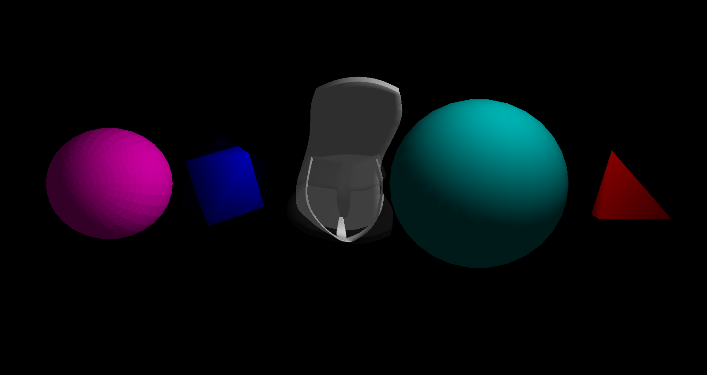

# SANDAL

**San(3) Dimension All-Over-The-Place Library**

I wanted to make 3D graphics without a Graphics Library so here we go!


Crazy sandal!

### Features
- No graphics API — pure TypeScript and the HTML `<canvas>` 2D context.
- Custom 3D pipeline — manual Model → View → Projection → Rasterization.
- Software shading — Gouraud (per-vertex) and Lambert (flat) lighting.
- FPS-style camera — keyboard-only movement and HUD.
- .OBJ loader — basic vertex/normal/face parsing.
- Depth buffer — simple z-buffer for proper occlusion.
- Primitives — Sphere, Box, Tetrahedron.
- Scene system — object transforms, materials, and lights.
- No dependencies beyond React + TypeScript.
- Runs fine!

I decided to leave this project as relatively unfinished.
Leaving the more technical bits to either when I go to university or if I rewrite it in C/C++ (probably actually using OpenGL this time like a sane person).


From left to right:
Lambert Sphere, Cube, sandal.obj model, gouraud sphere, tetrahedron.

---

## Table of Contents

- [Quick start](#quick-start)
- [Controls](#controls)
- [Structure](#structure)
- [Loading meshes](#loading-meshes)
- [Implementation / How it works](#implementation--how-it-works)
- [Notes](#notes)
- [Credit](#credit)

---

## [Quick start](#quick-start)
```bash
# 1) install deps
npm i
# 2) run dev server
npm run dev
# 3) open on the printed local url
```

## [Controls](#controls)

FPS like camera (no mouse)

* W / S: forward / back (XZ plane)

* A / D: strafe left / right (XZ plane)

* Arrow Left / Right: yaw

* Arrow Up / Down: pitch

Camera HUD shows x, y, z, yaw, pitch.

# [Structure](#structure)

main.tsx — React entry; mounts <App />.

App.tsx — creates a Renderer, loads a scene, runs the render loop.

classes.ts — core data types: Camera, Mesh, primitive generators (Sphere, Box, Tetrahedron), etc.

helpers.ts — math (matrices, barycentrics, HSL↔RGB), clipping, rasterization helpers.

shaders.ts — Gouraud (per-vertex) and Lambert (flat) shaders.

renderer.ts — frame buffer, depth buffer, triangle rasterization, per-vertex/per-face shading.

scene.ts — scene types: Transform, Material, lights, Scene definition.

loader.ts — SceneDef ➜ runtime Scene builder (applies defaults).

parse.ts — lightweight .OBJ parser (v, vn, f) + loadOBJURL().

controls.ts — keyboard handler for FPS camera.

## [Scenes configuration](#scenes-configuration)

Scenes are authored in code via SceneDef (see App.tsx + loader.ts).  (maybe I'll add a JSON parser at some point)

### Materials

shader: "gouraud" | "lambert"

color: [r,g,b,a] (0–255)

ambient: 0–1 (default 0.1)

albedo: 0–1 (default 0.6)

rainbow: boolean (optional; HSL cycling demo)

### Transforms

pos: [x,y,z],

rot: [rx,ry,rz] (radians, rotates every frame),

scale: number (optional)

### Loading meshes

```TS
import { loadOBJURL } from "./parse"
const mesh = await loadOBJURL("../models/sandal.obj")
```

Supports v, vn, and f (triangulated). To use your own model, place a .obj in models/ and update the URL.


## [Implementation / How it works](#implementation--how-it-works)

### Pipeline
Each object on the screen is a Mesh with defined Vertices and Triangles which join them.
The projectToScreen function is where most the work is done turning 3D to 2D.

Every vertex passes through several coordinate spaces before ending up as a pixel:

1. Model space –
    Local coordinates of the mesh as defined in the `.obj` or primitive generator.
    Each vertex starts here relative to the object’s origin.

2. World space –
    The vertex is multiplied by the object’s model matrix (`Transform`: position, rotation, scale).
    This places it correctly within the global scene.

3. View (Camera) space –
    The vertex is transformed by the view matrix, which represents the inverse of the camera’s transform.
    This effectively moves the world so the camera sits at the origin looking down -Z.

3.5. Lighting & Shading (in view space)
    - Transform normals with the inverse-transpose of the ModelView.
    - Compute lighting:
        - Ambient:  color *= ambient
        - Diffuse (Lambert): color += albedo * max(dot(n̂, l̂), 0)
    - Shading modes:
        - Gouraud: per-vertex intensity → interpolate across the triangle.
        - Lambert (flat): per-triangle intensity using the face normal.

4. Clip space –
    The vertex is projected using the perspective projection matrix (based on `fov`, `aspect`, `near`, `far`).
    Coordinates are now in homogeneous space `(x, y, z, w)`.

5. Normalized Device Coordinates (NDC) –
    Divide by `w` to get  x_ndc = x / w, y_ndc = y / w, z_ndc = z / w.
    Range: `[-1,1]` in all axes. Depth is stored for z-buffer comparison (to render objects in the correct order).

At this Point the shader is rasterized, shaded and written to the image buffer.

### Why 4D Matrices and Vertices?

In 3D graphics, we use 4D homogeneous coordinates `[x, y, z, w]` instead of just `[x, y, z]` to make perspective projection and translations work with a single matrix.

1. Matrix math needs 4D
    - A 3×3 matrix handles rotation and scale but cannot represent translation.
    - Adding a 4th coordinate (`w`) allows translation to be expressed in matrix form.
    - This enables every transform — rotation, scale, translation, projection — to be combined into one 4×4 matrix.

2. Perspective projection
    - After applying the projection matrix, vertices end up with a non-1 `w` value.
    - Dividing by `w` (`x /= w, y /= w, z /= w`) produces perspective foreshortening — objects farther from the camera appear smaller.
    - Without this division, you’d get an orthographic (non-perspective) view.

3. Geometric meaning
    - `w = 1` → normal point in space.
    - `w = 0` → point at infinity (used for directions like normals or light rays).
    - Homogeneous coordinates let us treat both points and directions uniformly in the same math pipeline.


## [Notes](#notes)

* No GPU :(
* No fancy shading just Gouraud and Lambert.
* Textures are unsupported.
* Culling is bodged.
* Slow when screen is full with an object (rendering more pixels).

## [Credit](#credit)

[sandal model](https://free3d.com/3d-model/menssandal-v01--23764.html)

[Gabriel Gambetta](https://gabrielgambetta.com/computer-graphics-from-scratch/index.html) I should probably actually read it...

[View Matrix](https://www.3dgep.com/understanding-the-view-matrix/#The_Camera_Transformation)

[Divine203 inspiration](https://github.com/Divine203/NoEngine)

[Scratchapixel](https://www.scratchapixel.com/)
